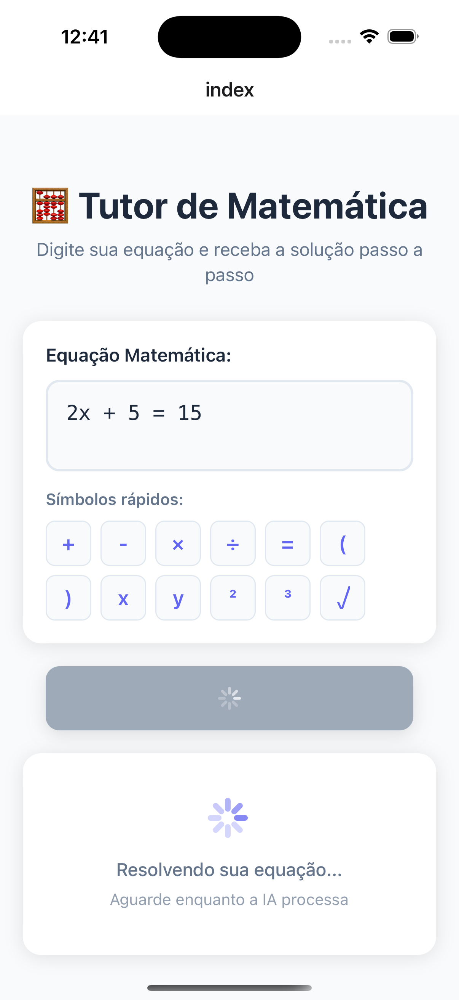

# 🧮 Tutor de Matemática - App React Native

Um aplicativo React Native inteligente que resolve equações matemáticas passo a passo usando a API do Google Gemini AI.


### 📸 Screenshots

<div align="center">
  
  
  
</div>


## 📋 Sobre o Projeto

Este app foi desenvolvido para ajudar estudantes e entusiastas de matemática a entender a resolução de equações de forma detalhada. Utilizando o poder da IA do Google Gemini, o app fornece explicações didáticas e passo a passo de como resolver diversos tipos de problemas matemáticos.

### ✨ Funcionalidades

- ✅ **Interface intuitiva e moderna** com design profissional
- ✅ **Teclado de símbolos matemáticos** para facilitar a digitação
- ✅ **Botão de limpar integrado** ao campo de input
- ✅ **Exemplos rápidos** para testar o app instantaneamente
- ✅ **Resolução passo a passo detalhada** com formatação inteligente
- ✅ **Formatação automática de Markdown** para melhor legibilidade
- ✅ **Destaque de fórmulas matemáticas** em containers especiais
- ✅ **Validação de entrada** antes de processar
- ✅ **Tratamento robusto de erros** com mensagens claras
- ✅ **Estados de loading** com feedback visual constante
- ✅ **Suporte para diversos tipos** de equações (lineares, quadráticas, radicais, etc.)

## 🚀 Como Começar

### Pré-requisitos

- Node.js (versão 16 ou superior)
- npm ou yarn
- Expo CLI
- Chave da API do Google Gemini

### 1. Instalação das Dependências

```bash
npm install
```

### 2. Configuração da API do Gemini

1. Obtenha sua chave da API em: [Google AI Studio](https://aistudio.google.com/app/apikey)
2. Copie o arquivo `.env.example` para `.env.local`:

```bash
cp .env.example .env.local
```

3. Edite o arquivo `.env.local` e adicione sua chave:

```env
EXPO_PUBLIC_GEMINI_API_KEY=sua_chave_api_aqui
```

⚠️ **Importante**: Nunca compartilhe sua chave da API publicamente ou faça commit dela no Git!

### 3. Executar o App

```bash
npx expo start
```

Você pode abrir o app em:

- 📱 [Expo Go](https://expo.dev/go) - Para testar rapidamente no seu celular
- 🤖 [Android Emulator](https://docs.expo.dev/workflow/android-studio-emulator/)
- 🍎 [iOS Simulator](https://docs.expo.dev/workflow/ios-simulator/)
- 🌐 Web browser (pressione `w` no terminal)

## 📁 Estrutura do Projeto

```
tutor-ai/
├── app/
│   └── index.tsx          # Tela principal do app
├── services/
│   └── tutor-gerator.js   # Serviço de integração com Gemini API
├── styles/
│   └── index.js           # Estilos globais do app
├── .env.example           # Exemplo de configuração
└── README.md              # Este arquivo
```

## 🎨 Tecnologias Utilizadas

- **React Native** - Framework para desenvolvimento mobile
- **Expo** - Plataforma para desenvolvimento React Native
- **TypeScript** - Tipagem estática para JavaScript
- **Google Gemini AI** - API de inteligência artificial
- **React Hooks** - Gerenciamento de estado

## 💡 Como Usar

1. **Digite a equação**: Insira sua equação matemática no campo de texto
2. **Use símbolos rápidos**: Clique nos botões de símbolos para inserir operadores matemáticos
3. **Resolva**: Pressione o botão "Resolver" e aguarde
4. **Veja a solução**: A resposta aparecerá em tempo real com explicação passo a passo

### Exemplos de Equações

- Equações lineares: `2x + 5 = 15`
- Equações quadráticas: `x² - 4 = 0`
- Sistemas de equações: `2x + y = 10 e x - y = 2`
- Inequações: `3x - 7 > 8`
- Problemas matemáticos em linguagem natural

## 🔧 Desenvolvimento

### Estrutura do Código

O código está organizado e comentado seguindo boas práticas:

- **Componentes**: Separação clara de responsabilidades
- **Serviços**: Lógica de API isolada
- **Estilos**: Design system com paleta de cores consistente
- **Comentários**: Documentação JSDoc em todas as funções principais

### Modificar Estilos

Os estilos estão centralizados em `styles/index.js`. Você pode personalizar:

- Cores (paleta definida no início do arquivo)
- Tamanhos de fonte
- Espaçamentos
- Bordas e sombras

## 🐛 Solução de Problemas

### Erro: "Chave da API não configurada"

- Verifique se o arquivo `.env.local` existe
- Confirme que a variável `EXPO_PUBLIC_GEMINI_API_KEY` está definida
- Reinicie o servidor Expo após criar o arquivo .env

### Erro de conexão com a API

- Verifique sua conexão com a internet
- Confirme que a chave da API é válida
- Verifique se há limites de uso da API

## 📝 Licença

Este projeto foi desenvolvido para fins educacionais.

## 🤝 Contribuições

Sugestões e melhorias são bem-vindas! Sinta-se à vontade para abrir issues ou pull requests.

## 📚 Recursos Adicionais

- [Documentação do Expo](https://docs.expo.dev/)
- [Documentação do React Native](https://reactnative.dev/)
- [Google Gemini AI](https://ai.google.dev/)
- [TypeScript Handbook](https://www.typescriptlang.org/docs/)
